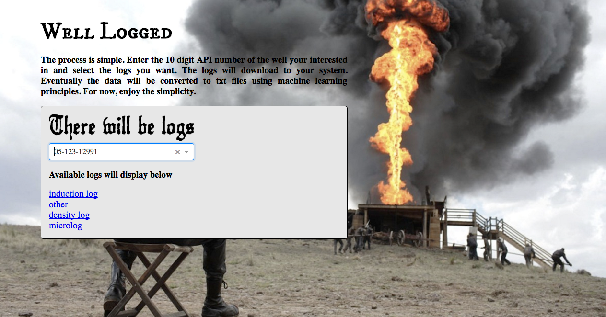

# Well Logged

# About
Well Logged provides access to well logs that were collected during the drilling for oil and gas. Because the data is difficult to obtain from state websites, I have scraped the data and made it easier the process simpler. In addition, I plan on applying machine learning techniques to convert the TIFF images into useable txt files that can be imported into standard software programs in the petroleum industry.

# Tech

<h3 font-size= 4em>axios</h3>
<h3 font-size= 4em>React-Select</h3>

# Mockup

